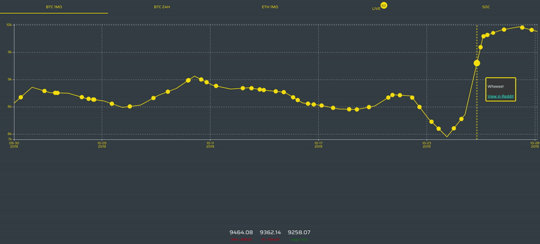
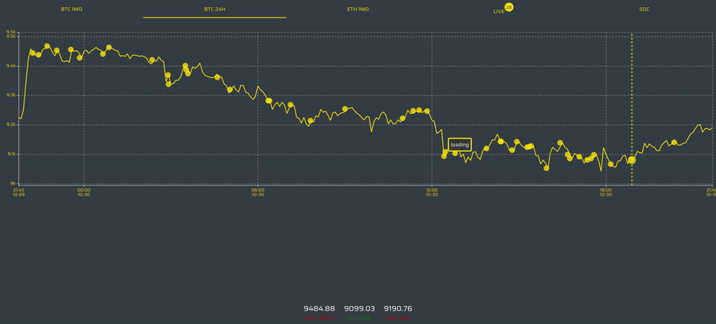
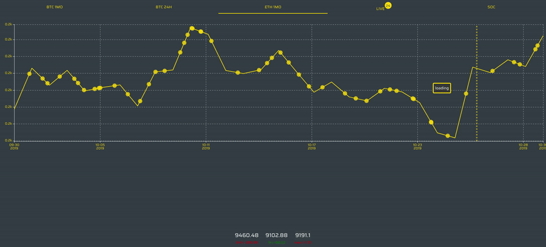
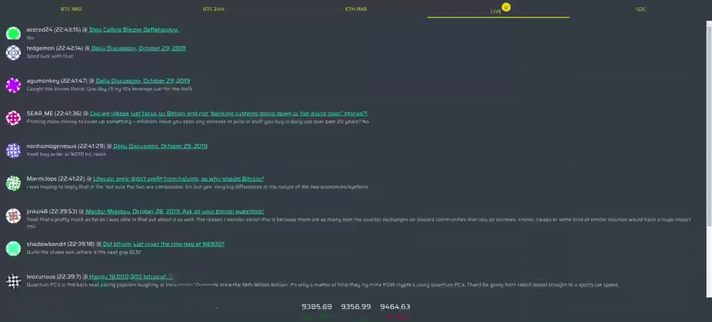

# Reddit + Crypto WebApp (BackEnd)

Integrates Reddit API with Crypto prices to display useful charts.

## Install

```bash

# install and start mongodb
# https://docs.mongodb.com/manual/installation/

# clone this repo
git clone https://github.com/deandreee/btcftw_be.git
# cd to repo
cd btcftw_be
# install dependencies
npm i
# start
npm start

# install and start FrontEnd
# https://github.com/deandreee/btcftw_fe#install

# open http://localhost:3000/btc

```

## Features

Each tab has its own feature.

### BTC 1Mo

Combines **1 month BTC price** chart with TOP Reddit comments for _/r/bitcoin_



### BTC 24h

Combines **24 hour BTC price** chart with TOP Reddit comments for _/r/bitcoin_



### ETH 1Mo

Combines **1 month ETH** price chart with TOP Reddit comments for _/r/ethereum_



### LIVE

**WebSockets LIVE** stream of _/r/bitcoin_ comments



### SOC

Displays chart of new Reddit **posts/comments/subscribers** for _TOP200 Coins_


